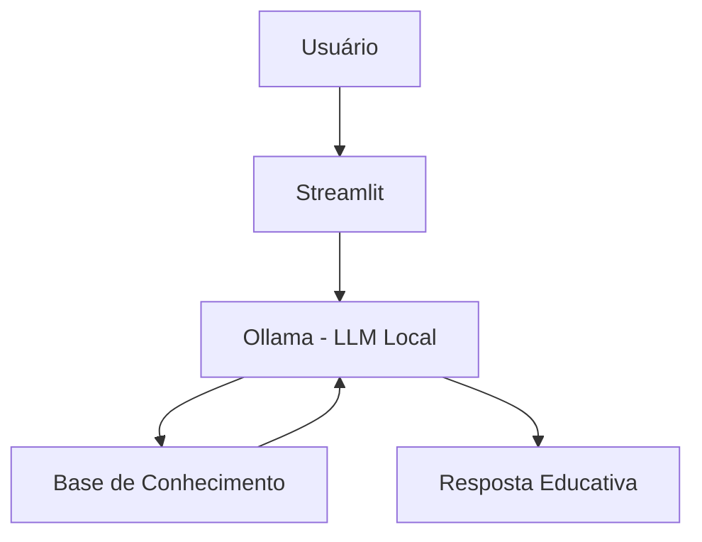

# 🎓 Fia - Educadora Financeira Inteligente

Agente de IA Generativa que ensina conceitos de finanças pessoais de forma simples e personalizada, usando os próprios dados do cliente como exemplos práticos.

 
 


[](https://www.youtube.com/watch?v=kVIOm0u_jzc)


## 💡 O Que é a Fia?

a Fia  é uma educadora financeira que **ensina**, não recomenda. Ela explica conceitos como reserva de emergência, tipos de investimentos e análise de gastos usando uma abordagem didática e exemplos concretos baseados no perfil do cliente.

**O que a Fia faz:**
- ✅ Explica conceitos financeiros de forma simples
- ✅ Usa dados do cliente como exemplos práticos
- ✅ Responde dúvidas sobre produtos financeiros
- ✅ Analisa padrões de gastos de forma educativa

**O que a Fia NÃO faz:**
- ❌ Não recomenda investimentos específicos
- ❌ Não acessa dados bancários sensíveis
- ❌ Não substitui um profissional certificado

## 🏗️ Arquitetura



**Stack:**
- Interface: Streamlit
- LLM: Ollama (modelo local `gpt-oss`)
- Dados: JSON/CSV mockados

## 📁 Estrutura do Projeto

```
├── data/                          # Base de conhecimento
│   ├── perfil_investidor.json     # Perfil do cliente
│   ├── transacoes.csv             # Histórico financeiro
│   ├── historico_atendimento.csv  # Interações anteriores
│   └── produtos_financeiros.json  # Produtos para ensino
│
├── docs/                          # Documentação completa
│   ├── 01-documentacao-agente.md  # Caso de uso e persona
│   ├── 02-base-conhecimento.md    # Estratégia de dados
│   ├── 03-prompts.md              # System prompt e exemplos
│   ├── 04-metricas.md             # Avaliação de qualidade
│   └── 05-pitch.md                # Apresentação do projeto
│
└── src/
    └── app.py 
    └── utils/
        └── transform_data.py                    
```

## 🚀 Como Executar

### Pré-requisitos
- Python 3.10+
- [Ollama](https://ollama.com) instalado

### Passo a passo

**1. Clone o repositório**
```bash
git clone https://github.com/LuGodoy/dio-lab-bia-do-futuro.git
cd dio-lab-bia-do-futuro
```

**2. Instale o modelo - baixe em ollama.com**
```bash
ollama pull gpt-oss
ollama serve
```

**3. Instale as dependências**
```bash
pip install -r requirements.txt
```

**4. Rode o app**
```bash
streamlit run src/app.py
```

Acesse em: `http://localhost:8501`

## 🎯 Exemplo de Uso

**Pergunta:** "O que é CDI?"  
**Fia:** "CDI é uma taxa de referência usada pelos bancos. Quando um investimento rende '100% do CDI', significa que ele acompanha essa taxa. Hoje o CDI está próximo da Selic. Quer que eu explique a diferença entre os dois?"

**Pergunta:** "Onde estou gastando mais?"  
**Fia:** "Olhando suas transações de outubro, sua maior despesa é moradia (R$ 1.380), seguida de alimentação (R$ 570). Juntas, representam quase 80% dos seus gastos. Isso é bem comum! Quer que eu explique algumas estratégias de organização?"

## 📊 Métricas de Avaliação

| Métrica | Objetivo |
|---------|----------|
| **Assertividade** | O agente responde o que foi perguntado? |
| **Segurança** | Evita inventar informações (anti-alucinação)? |
| **Coerência** | A resposta é adequada ao perfil do cliente? |

## 🎬 Diferenciais

- **Personalização:** Usa os dados do próprio cliente nos exemplos
- **100% Local:** Roda com Ollama, sem enviar dados para APIs externas
- **Educativo:** Foco em ensinar, não em vender produtos
- **Seguro:** Estratégias de anti-alucinação documentadas

## 📝 Documentação Completa

Toda a documentação técnica, estratégias de prompt e casos de teste estão disponíveis na pasta [`docs/`](./docs/).

---

<p align="center">
  Desenvolvido por <b>Luciene Godoy</b><br>
  🏠 <b>Meu Projeto Principal com MCP:</b> <a href="https://github.com/LuGodoy/finance-agent-mcp">Visite aqui</a><br>
  <i>Este projeto faz parte de um desafio do Bootcamp DIO e Bradesco - GenAI & Dados</i>
</p>

<p align="center">
  <a href="http://www.linkedin.com/in/luciene-godoy-b8670a179"></a>
  <a href="https://github.com/LuGodoy"></a>
</p>