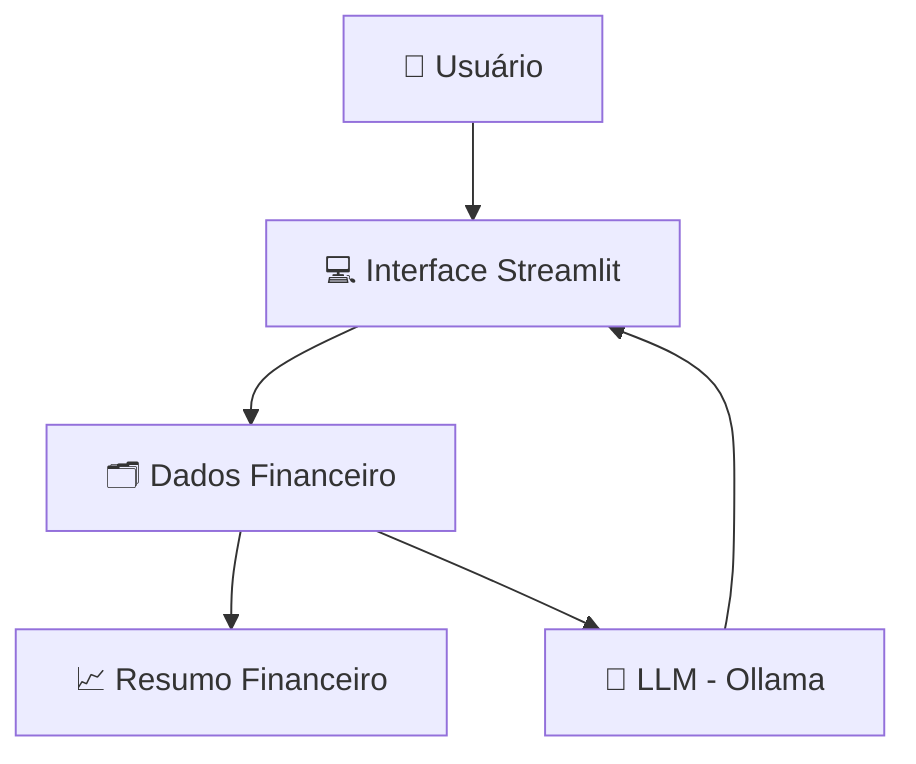

# 📄 Documentação do Agente

## 🎯 Caso de Uso

### Problema
Muitas pessoas têm dificuldade em entender conceitos básicos de finanças pessoais e organizar seus gastos de forma clara.

### Solução
O agente atua como uma interface inteligente que transforma dados de planilhas (`transacoes.txt`) em um **Relatório de Saúde Financeira** no Streamlit.  
De forma proativa, ele explica os gastos (ex: moradia) e mostra quanto do orçamento ainda está disponível para metas e investimentos.

### Público-Alvo
Iniciantes em finanças e profissionais que buscam **clareza visual e prática** sobre seu fluxo de caixa e evolução financeira.

---

## 🧠 Persona e Tom de Voz

### Nome do Agente
**Fia (Assistente Financeira)**

### Personalidade
- Informativa e paciente   
- Incentivadora e focada em progresso  

### Tom de Comunicação
Informal, acessível e didático, evitando termos técnicos desnecessários.

### Exemplos de Linguagem
- **Saudação:**  
  "Oi! Sou a Fia. Quais suas dúvidas sobre seus gastos?"

- **Confirmação:**  
  "Notei que moradia representa uma parte importante do seu orçamento."

- **Limitação:**  
  "Posso te explicar como esse investimento funciona, mas a decisão é sempre sua."

---

## 🏗️ Arquitetura

### Diagrama

---

### Componentes

| Componente | Descrição |
|------------|-----------|
| Interface | [Streamlit](https://streamlit.io/) - Exibe o respostas das dúvidas e o Infográfico de Despesas médias do trimestre.|
| LLM | Ollama (local) - Processa a lógica de categorização e explicação didática.|
| Base de Conhecimento | Dados (Perfil e Transações) e Catálogo de Produtos (JSON/CSV) mockados na pasta `data` |

---

## Segurança e Anti-Alucinação

### Estratégias Adotadas

- [X] Cálculo Preciso: O agente soma corretamente as categorias antes de exibir.
- [X] Filtro de Recomendação: A Fia nunca usa verbos imperativos como "compre" ou "invista".
- [X] Contexto Histórico: Consulta o historico_atendimento.txt para saber que o usuário já perguntou sobre Tesouro Selic antes.

### Limitações Declaradas

- NÃO realiza transações financeiras reais.
- NÃO altera os dados nas fontes; apenas os lê para gerar os relatórios no Streamlit.
- NÃO sugere produtos fora do produtos_financeiros.txt